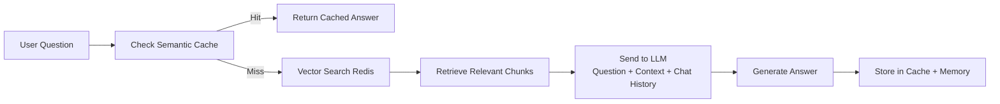

# AI Documentation Assistant  
### RAG + Semantic Cache + Memory

An intelligent AI assistant that ingests documentation, answers questions using **Retrieval-Augmented Generation (RAG)**, caches semantically similar queries to reduce LLM costs, and maintains **conversation memory within a session** *(cross-session memory not yet implemented)*.

> The system improves over time by learning from previous interactions and avoiding redundant LLM calls.

---

## Features

- Document Ingestion Pipeline (ETL)
- Vector Search with Redis
- RAG-based Question Answering
- Semantic Caching *(cost & latency optimization)*
- Session-based Chat Memory

---

## Architecture Overview

---

### 1. Document Ingestion (ETL Pipeline)

#### Key Steps

- Load documentation files *(Markdown, HTML, TXT)*
- Split into ~500-token chunks *(with overlap)*
- Generate embeddings
- Store in Redis with metadata:
  - Source file

---

### 2. Chat & Retrieval Flow

---

## Tech Stack

| Component        | Technology                          |
|----------------|----------------------------------|
| LLM Provider | Ollama                           |
| Embeddings   | Ollama-compatible embedding model |
| Vector DB    | Redis Stack (Vector Search)       |
| Backend      | Java, Spring Boot, Spring AI      |

---

## Notes

- Semantic caching helps reduce both **latency** and **LLM costs**
- Memory is currently **session-scoped only**
- System performance improves with usage due to cache reuse

---

## Future Improvements

- Cross-session persistent memory
- Multi-document reasoning
- UI for document management

---
